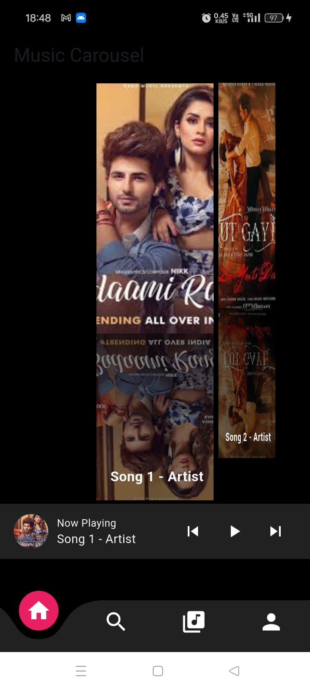

# Music Carousel App

This Flutter application features a music carousel with Firebase authentication. The app provides a visually appealing interface similar to popular music players like Spotify, allowing users to browse through songs with a smooth carousel effect.

## Features

- **Firebase Authentication**: Secure user authentication using Firebase.
- **Music Carousel**: A dynamic carousel that displays album covers with a reflection effect.
- **Smooth Transitions**: Enhanced animations for a seamless user experience.
- **Music Player Bar**: A functional music player bar with play, pause, and skip controls.
- **Responsive Design**: Adapts to different screen sizes and orientations.

## Screenshots



## Video Demo

[Watch the demo video](https://www.example.com/your-video-link)

## Installation

1. **Clone the repository**:
   ```bash
   git clone https://github.com/yourusername/music-carousel-app.git
Navigate to the project directory:

BASH

cd music-carousel-app
Install dependencies:

BASH

flutter pub get
Run the app:

BASH

flutter run
Configuration
Firebase Setup: Ensure you have a Firebase project set up and include the google-services.json file in the android/app directory.
Assets: Ensure all image assets are correctly placed in the assets/Images directory and listed in the pubspec.yaml file.
Usage
Authentication: Users can sign up and log in using Firebase authentication.
Carousel Navigation: Swipe left or right to browse through the music carousel.
Music Controls: Use the music player bar to play, pause, or skip tracks.
Contributing
